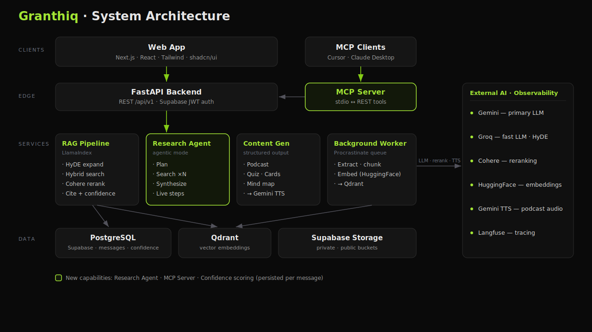

<div align="center">

  

  # Granthiq

  **Knowledge, witnessed.**

  *Document intelligence for people who read carefully.*

  [](https://nextjs.org/)
  [](https://fastapi.tiangolo.com/)
  [](https://www.python.org/)
  [](https://www.typescriptlang.org/)
  [](https://opensource.org/licenses/MIT)

  [Features](#-features) ·
  [Architecture](#-architecture) ·
  [How It Works](#-how-it-works) ·
  [Quick Start](#-quick-start) ·
  [Documentation](#-documentation) ·
  [Deployment](#-deployment)

</div>

---

## What is Granthiq?

**Granthiq** is an AI-powered document intelligence platform — conceptually similar to Google NotebookLM, but built as a full-stack, self-hostable system with production-grade RAG, agentic research, and trust-first design.

Upload your sources — PDFs, lectures, web pages, audio, YouTube videos — and Granthiq turns them into an **interactive, citable knowledge base**. Ask hard questions, get answers that cite every claim, generate study artifacts, and run a multi-step **Research Agent** when a single query isn't enough.

> *From granth — the tradition of reading texts deeply, with proof.*

Built for researchers, students, and knowledge workers who refuse to guess where an answer came from.

---

## The Problem

| Challenge | What goes wrong today |
|-----------|----------------------|
| **Information overload** | Hundreds of pages across papers, notes, and lectures — impossible to synthesize manually |
| **Untrustworthy AI** | Generic chatbots hallucinate without grounding in your actual sources |
| **No traceability** | "Where did this fact come from?" — no page-level proof |
| **Shallow retrieval** | Basic vector search misses exact terms and complex cross-document questions |
| **One-size-fits-all output** | Dense PDFs don't automatically become quizzes, podcasts, or flashcards |

## The Solution

Granthiq addresses each of these with a deliberate, layered stack:

- **Hybrid RAG** — dense semantic search + sparse keyword search, fused in Qdrant
- **Query expansion** — HyDE (Hypothetical Document Embeddings) with timeout fallback
- **Reranking** — Cohere reranker for precision on top candidates
- **Hallucination guardrails** — policy layer refuses to answer when context is insufficient
- **Confidence scoring** — every answer carries a persisted trust level (High / Moderate / Low)
- **Research Agent** — Plan → Search → Synthesize for complex, multi-faceted questions
- **Content generation** — podcasts, quizzes, flashcards, and mind maps from your corpus
- **MCP integration** — expose notebooks as tools to Cursor and Claude Desktop

---

## Features

### Notebook Workspace

A three-panel resizable interface for focused research:

| Panel | What you do |
|-------|-------------|
| **Sources** | Upload and manage documents; poll processing status until indexed |
| **Chat** | Ask questions with streaming responses, inline citations, and confidence badges |
| **Studio** | Generate podcasts, quizzes, flashcards, mind maps; take rich-text notes |

### Document Ingestion

Supports multiple source types with async background processing:

- **PDF, DOCX, TXT** — parsed via Unstructured.io with page-aware chunking
- **Audio** — transcribed via AssemblyAI
- **Web URLs** — scraped via Firecrawl
- **YouTube** — transcript extraction via yt-dlp
- **Google Drive** — import via OAuth

Files are streamed to Supabase Storage (never loaded entirely into RAM), chunked, embedded with HuggingFace Sentence Transformers, and indexed in Qdrant with metadata filters (`user_id`, `notebook_id`, `document_id`, `page_number`).

### AI Chat with Citations

Standard RAG mode for factual questions, summaries, and definitions:

1. User sends a message → hybrid retrieval runs against the notebook corpus
2. Chunks are reranked → policy layer filters low-confidence results
3. LLM synthesizes a cited answer → streamed via Server-Sent Events (SSE)
4. Citations link to exact source chunks with relevance scores
5. Confidence metadata is persisted on the message — survives page reload

### Research Agent Mode

For complex questions that need decomposition — comparisons, multi-paper synthesis, cross-source analysis:

```
User Question
    → PLAN:    LLM breaks into 2–4 focused sub-queries
    → SEARCH:  Hybrid RAG runs for each sub-query
    → SYNTHESIZE: LLM writes a cited answer from deduplicated sources
```

Agent steps stream live to the UI so users see exactly what the system is doing.

### Confidence UI

Every assistant message carries an aggregate confidence level derived from reranker scores:

| Level | Meaning |
|-------|---------|
| **High** | Strong source match — answer is well-grounded |
| **Moderate** | Reasonable match — review citations |
| **Low** | Weak match — treat with caution |

Thresholds are configurable per notebook in Settings → Retrieval Parameters.

### Studio / Content Generation

Turn dense material into study-ready formats:

| Format | Output |
|--------|--------|
| **Podcast** | Multi-speaker dialogue script → Gemini TTS → MP3 |
| **Quiz** | Structured Q&A via LLM + Pydantic schemas |
| **Flashcards** | Front/back pairs for spaced repetition |
| **Mind Map** | Nodes and edges for visual concept mapping |
| **Notes** | TipTap rich-text editor with auto-save |

### MCP Server

Granthiq exposes notebooks as **Model Context Protocol tools** for external AI clients:

```
Cursor / Claude Desktop
        │ MCP (stdio)
        ▼
   mcp-server/server.py
        │ REST + JWT
        ▼
   Granthiq FastAPI Backend
```

Available tools: `list_notebooks`, `list_documents`, `ask_notebook`, `research_notebook`, `get_chat_history`.

See [mcp-server/README.md](./mcp-server/README.md) for setup.

---

## Architecture

<p align="center">
  
</p>

### System Overview

```
Browser (Next.js)                    MCP Clients (Cursor)
        │ REST + SSE + JWT                    │ MCP stdio
        ▼                                     ▼
              FastAPI Backend (/api/v1)
        Routers → Services → Repositories
        │
        ├── PostgreSQL (Supabase)     — users, notebooks, messages, citations
        ├── Qdrant                    — vector embeddings (hybrid dense + sparse)
        ├── Supabase Storage          — private uploads + public generated media
        ├── Procrastinate Worker      — async document processing + generation
        └── External AI               — Gemini, Groq, Cohere, HuggingFace, Langfuse
```

### Design Patterns

| Pattern | Where | Why |
|---------|-------|-----|
| **Layered architecture** | Routers → Services → Repositories | Clear separation of concerns |
| **Repository pattern** | All DB access | Ownership checks, testability |
| **Builder pattern** | `QueryEngineBuilder` | Composable RAG pipeline |
| **JIT user provisioning** | First authenticated request | No separate registration API |
| **SSE streaming + post-stream persistence** | Chat endpoint | Tokens stream live; message saved after completion |
| **Memory-safe uploads** | `upload_stream()` | Large PDFs never loaded into RAM |
| **Graceful degradation** | Cohere rerank, TTS | Optional providers skip instead of crashing |

---

## How It Works

### Document Upload → Indexed

```
Upload file → stream to Supabase (notebook-private bucket)
           → Document row created (status: PENDING)
           → Procrastinate worker: download → parse → chunk → embed
           → Index in Qdrant with metadata filters
           → Status: COMPLETED
```

### Chat Query (Standard RAG)

```
User message → Query Fusion + HyDE expansion
            → Hybrid search (Qdrant: dense + sparse, alpha-weighted)
            → Cohere rerank
            → Policy layer (score threshold + min chunk count)
            → LLM synthesis with citations
            → Stream tokens + confidence metadata via SSE
            → Persist message + citations after stream completes
```

### Research Agent

```
Complex question → LLM plans 2–4 sub-queries
                → RAG pipeline per sub-query
                → Deduplicate sources across queries
                → LLM synthesizes cited final answer
                → Stream agent_step events + answer
```

---

## Tech Stack

| Layer | Technology |
|-------|------------|
| **Frontend** | Next.js 16 (App Router), React 19, TypeScript, Tailwind CSS 4, shadcn/ui, Framer Motion |
| **Backend** | FastAPI, Python 3.12+, SQLModel, Alembic, Uvicorn |
| **Database** | PostgreSQL via Supabase (async `asyncpg`) |
| **Vector DB** | Qdrant (hybrid dense + sparse/BM42 fusion) |
| **Auth** | Supabase Auth (JWT, Google OAuth, SSR cookies) |
| **Object Storage** | Supabase Storage (`notebook-private`, `notebook-public`) |
| **RAG Framework** | LlamaIndex 0.14 |
| **LLMs** | Gemini (primary), Groq (HyDE + fast generation) |
| **Embeddings** | HuggingFace Sentence Transformers (`all-MiniLM-L6-v2`) |
| **Reranking** | Cohere (`rerank-english-v3.0`) |
| **Task Queue** | Procrastinate (PostgreSQL-backed, embedded worker) |
| **TTS** | Gemini TTS API (podcast audio) |
| **Ingestion** | Unstructured.io, yt-dlp, Firecrawl, AssemblyAI |
| **Observability** | Langfuse, Loguru, Sentry, PostHog |
| **Testing** | pytest (backend), Jest + RTL (frontend), RAGAS evaluation |
| **Deployment** | Docker, Coolify / Railway / Vercel |

---

## Project Structure

```
Granthiq/
├── frontend/                  # Next.js 16 app
│   ├── app/                   # App Router (landing, home, notebook, auth, docs)
│   ├── components/            # chat-panel, sources-panel, studio-panel, etc.
│   ├── hooks/                 # useNotes, useStudio, useSuggestedQuestions
│   ├── lib/api/               # Typed REST + SSE clients
│   └── public/                # architecture.svg, logos
│
├── backend/                   # FastAPI application
│   ├── src/
│   │   ├── routers/           # Thin HTTP layer (/chat, /documents, /generation)
│   │   ├── services/          # Business logic (chat, query, agent, ingestion, generation)
│   │   ├── db/                # SQLModel models + repositories
│   │   └── schemas/           # Pydantic request/response models
│   ├── migrations/            # Alembic + RLS SQL
│   ├── tests/                 # Unit, integration, RAGAS evaluation
│   └── docs/                  # Architecture, API, deployment guides
│
├── mcp-server/                # MCP tool provider for Cursor / Claude Desktop
│   └── server.py
│
├── LOCAL_SETUP.md             # Full local dev guide (~30–45 min)
└── README.md                  # You are here
```

---

## Quick Start

> Full step-by-step guide with Supabase, Qdrant, and env setup: **[LOCAL_SETUP.md](./LOCAL_SETUP.md)**

### Prerequisites

| Tool | Version |
|------|---------|
| Node.js | 18+ |
| Python | 3.12+ |
| [uv](https://docs.astral.sh/uv/) | latest |
| Docker | optional (local Qdrant) |

**API keys needed:** [Supabase](https://supabase.com) (required), [Gemini](https://aistudio.google.com/) (required), [Groq](https://console.groq.com/) (recommended), [Qdrant](https://cloud.qdrant.io/) or Docker (required), [Cohere](https://dashboard.cohere.com/) (optional, reranking)

### 1. Clone

```bash
git clone https://github.com/sahilleth/Granthiq.git
cd Granthiq
```

### 2. Backend

```bash
cd backend
uv sync
cp .env.example .env          # fill in your keys
uv run python -m procrastinate --app src.services.queue.app.proc_app schema --apply
uv run alembic upgrade head
uv run uvicorn src.app:app --host 0.0.0.0 --port 8000 --reload
```

API docs: [http://localhost:8000/docs](http://localhost:8000/docs)

### 3. Frontend

```bash
cd frontend
npm install
cp .env.example .env.local    # fill in Supabase + API URL
npm run dev
```

Open [http://localhost:3000](http://localhost:3000) → sign up → create a notebook → upload a PDF → chat with citations.

### 4. MCP (optional)

```bash
cd mcp-server
pip install -r requirements.txt
export GRANTHIQ_API_URL=http://localhost:8000
export GRANTHIQ_API_TOKEN=<your-supabase-jwt>
```

See [mcp-server/README.md](./mcp-server/README.md) for Cursor / Claude Desktop config.

---

## Documentation

### Getting Started

| Document | Description |
|----------|-------------|
| [LOCAL_SETUP.md](./LOCAL_SETUP.md) | Complete local dev setup with Supabase, Qdrant, env vars, and smoke test |
| [frontend/README.md](./frontend/README.md) | Frontend-specific setup, components, and deployment |
| [backend/README.md](./backend/README.md) | Backend-specific setup, API, and deployment |

### Architecture & API

| Document | Description |
|----------|-------------|
| [backend/docs/ARCHITECTURE.md](./backend/docs/ARCHITECTURE.md) | Backend layered architecture, RAG flows, security |
| [backend/docs/API.md](./backend/docs/API.md) | Full REST API reference |
| [backend/docs/MODELS.md](./backend/docs/MODELS.md) | Database schema and relationships |
| [backend/docs/TECHNICAL_CHALLENGES_AND_SOLUTIONS.md](./backend/docs/TECHNICAL_CHALLENGES_AND_SOLUTIONS.md) | Engineering deep-dives (streaming persistence, guardrails, HyDE) |
| [frontend/docs/ARCHITECTURE.md](./frontend/docs/ARCHITECTURE.md) | Frontend architecture, hooks, API client |

### Operations

| Document | Description |
|----------|-------------|
| [backend/docs/DEPLOYMENT.md](./backend/docs/DEPLOYMENT.md) | Docker, Coolify, Railway deployment |
| [backend/docs/CONFIGURATION.md](./backend/docs/CONFIGURATION.md) | All environment variables explained |
| [backend/docs/TROUBLESHOOTING.md](./backend/docs/TROUBLESHOOTING.md) | Common issues and fixes |
| [mcp-server/README.md](./mcp-server/README.md) | MCP server setup for Cursor / Claude Desktop |

### In-App Docs

The frontend includes a built-in documentation site at `/docs` when running locally — architecture, API client, hooks, components, and more.

---

## Deployment

### Vercel (Frontend + Backend together)

This repo includes a root [`vercel.json`](./vercel.json) for [Vercel Services](https://vercel.com/docs/services) — one project, one domain, frontend + FastAPI backend.

**Import the repo** on Vercel with **Root Directory** set to `.` (repository root, not `frontend/`).

| Route | Service |
|-------|---------|
| `/` | Next.js frontend |
| `/api/backend/*` | FastAPI backend (rewritten to `/api/v1/*` internally) |

**Frontend env vars** (Vercel → Settings → Environment Variables):

```env
NEXT_PUBLIC_SUPABASE_URL=https://your-project.supabase.co
NEXT_PUBLIC_SUPABASE_PUBLISHABLE_KEY=your_key
NEXT_PUBLIC_API_URL=/api/backend
NEXT_PUBLIC_APP_URL=https://your-app.vercel.app
```

**Backend env vars** — add all keys from `backend/.env.example` (Supabase, Qdrant, Gemini, Groq, etc.):

```env
ENVIRONMENT=production
ENABLE_EMBEDDED_WORKER=false
SKIP_WARMUP=true
API__CORS_ORIGINS=["https://your-app.vercel.app"]
```

> **Note:** The backend is heavy (LlamaIndex, embeddings, document parsing). If the Python build exceeds Vercel's size limit, deploy the backend separately on [Railway](https://railway.app) or [Coolify](https://coolify.io) and set `NEXT_PUBLIC_API_URL` to that URL instead.

### Split deployment (recommended for production)

| Component | Platform | Notes |
|-----------|----------|-------|
| **Frontend** | [Vercel](https://vercel.com) | Set `NEXT_PUBLIC_SUPABASE_*` and `NEXT_PUBLIC_API_URL` |
| **Backend** | Docker on VPS / [Coolify](https://coolify.io) / Railway | Multi-stage Dockerfile with `runtime` and `worker` targets |
| **Database** | [Supabase](https://supabase.com) | Postgres + Auth + Storage in one |
| **Vectors** | [Qdrant Cloud](https://cloud.qdrant.io) or self-hosted | Hybrid search collection |
| **Worker** | Embedded in API process or separate container | `ENABLE_EMBEDDED_WORKER=true` for small deployments |

```bash
# Production backend
docker compose -f backend/docker-compose.prod.yml up -d
```

See [backend/docs/DEPLOYMENT.md](./backend/docs/DEPLOYMENT.md) for full instructions.

---

## Testing

```bash
# Backend — unit + integration (CI uses Postgres + Qdrant containers)
cd backend && uv run pytest tests/ -v --cov=src

# Frontend — Jest + React Testing Library
cd frontend && npm test
```

---

## What Makes Granthiq Different

| Capability | Basic RAG chatbot | Granthiq |
|------------|-------------------|----------|
| Search | Vector only | Hybrid dense + sparse + query fusion |
| Query expansion | None | HyDE with timeout fallback |
| Reranking | None | Cohere (graceful skip if unavailable) |
| Hallucination control | None | Policy layer → refuses when context is weak |
| User trust | None | Confidence badge persisted per message |
| Complex questions | Single query | Research Agent (plan → search → synthesize) |
| Citations | Optional | Page-level, scored, clickable |
| Content types | Text only | Podcast, quiz, flashcards, mind map |
| External access | Web UI only | MCP tools for Cursor / Claude Desktop |
| Ingestion | PDF only | PDF, audio, web, YouTube, Google Drive |
| Per-notebook tuning | Global config | JSON settings per notebook |
| Upload safety | `file.read()` | Streaming (memory-safe) |

---

## Contributing

Contributions are welcome. See [backend/docs/CONTRIBUTING.md](./backend/docs/CONTRIBUTING.md) for guidelines.

1. Fork the repository
2. Create a feature branch (`git checkout -b feature/my-feature`)
3. Commit your changes
4. Push and open a Pull Request

---

## License

This project is licensed under the MIT License.

---

<div align="center">

  **Granthiq** — *Knowledge, witnessed.*

  [GitHub](https://github.com/sahilleth/Granthiq) · [Frontend](./frontend) · [Backend](./backend) · [MCP Server](./mcp-server)

</div>
